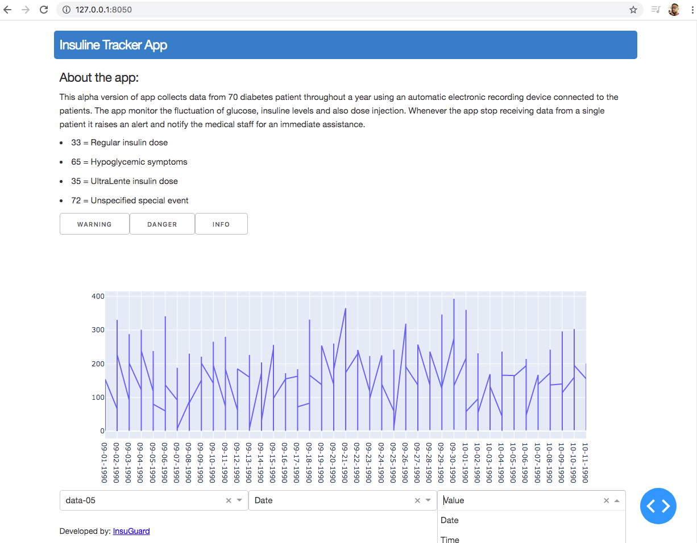

# Insuline Tracker App

This alpha version of the app collects data from 70 diabetes patient throughout a year using an automatic electronic recording device connected to the patients. The app monitor the fluctuation of glucose, insuline levels and also dose injection. Whenever the app stop receiving data from a single patient it raises an alert and notify the medical staff for an immediate assistance.

#### By team Insuguard during the Together vs virus online hackathon against COVID19: 


#### 	 Dataset:
See source: http://archive.ics.uci.edu/ml/datasets/diabetes

#### 	 App Creation:
Created the web app using the framework [Dash](https://plotly.com/dash/). 



## Repo content 

		├── .gitignore
		├── README.md
		│  
		├── assests   # Contains the Boostrap stylesheet file
		│  
		├── imgs   # Contains images, screenshots...
		│  
		├── patient-data   # Contains the dataset
		│   
		├──__init__.py    
		│   
		├── app.py   # main module for dash codes front end and managing callbacks
		│   
		├── utils.py  # Utility Functions like data collection, set conditions for failures cases
		│  
		├── model.pu  # connect the utilitis and the conditions loop for sending alert 


## Prerequisites

Make sure to have [pip](https://pip.pypa.io/en/stable/) and [Python3+](https://www.python.org/downloads/) installed in your local machine. 


## Set up and Run it

From comnand line:

1. Clone repo  ``` $ git clone https://github.com/mtfaye/InsuGard.git ```

2. Change directory ``` $ cd /inside the cloned directory ```

3. Create a virtual environment venv, activate it and install the necessary dependencies.
		
	     $ python3 -m venv venv
		
	     $ source venv/bin/activate
		
	     $ pip install -r requirements.txt
	     
4. Run the app now.
		
	     $ python3 app.py
	     
	     
	  
	  
## Enjoy! 
	 


